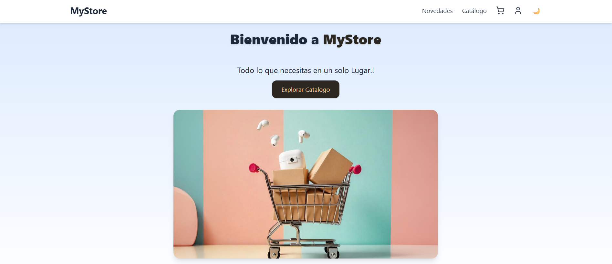
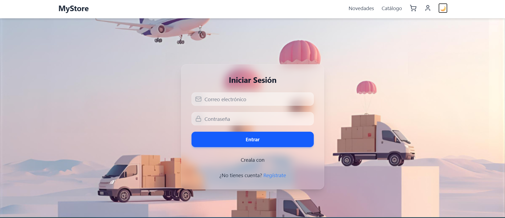
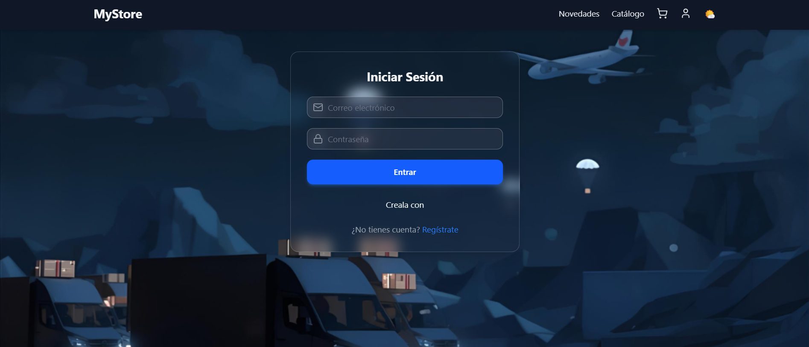
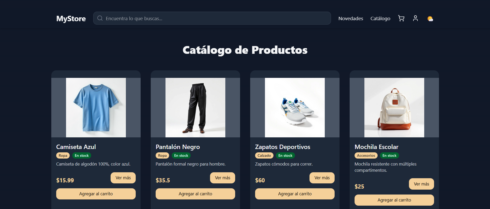

# 🛒 MyStore E-commerce

Proyecto full-stack de un **E-commerce moderno** desarrollado con **React + Vite (frontend)** y **Node.js + Express + MongoDB (backend)**.  
Incluye carrito de compras, catálogo dinámico, autenticación, login con modal estilo *Apple Glass*, y soporte de pagos con tarjeta/PayPal (demo).

---

## 👩‍💻 Tecnologías utilizadas

### 🖥️ Frontend
- **React + Vite** → interfaz rápida y moderna.
- **TailwindCSS** → estilos responsivos y diseño limpio.
- **Lucide-react** → iconos modernos.
- **React Router DOM** → navegación entre vistas.
- **Context API** → manejo global del carrito.
- **Modales custom** → estilo *Apple Glass* para login/alertas.

### ⚙️ Backend
- **Node.js + Express** → servidor de API REST.
- **MongoDB + Mongoose** → base de datos para productos, usuarios y órdenes.
- **Rutas protegidas** para pedidos, productos y usuarios.

### ☁️ Deploy
- **Frontend** en **Netlify** (`/client`).
- **Backend** en **Render** (`/server`).

---

## 📂 Estructura del proyecto

📁 root
 - **📁 client # Frontend (React + Vite)
   ── src
   ── package.json
   ── ...
- **📁 server # Backend (Node + Express)
   ── models
   ── routes
   ── index.js
   ── package.json
   ── ...
netlify.toml # Configuración para Netlify

---

## 🔑 Funcionalidades principales

- Catálogo de productos con buscador.
- Carrito de compras con Context API.
- Sección de novedades (landing page).
- Login con modal de estilo *Apple Glass*.
- Dark Mode 🌙 / ☀️.
- Integración de métodos de pago (demo).
- API REST con endpoints para:
  - `GET /products`
  - `POST /orders`
  - `POST /users/login` (demo)

---

## Home

## Login DayMode

## Login DarkMode

## Catalogo

